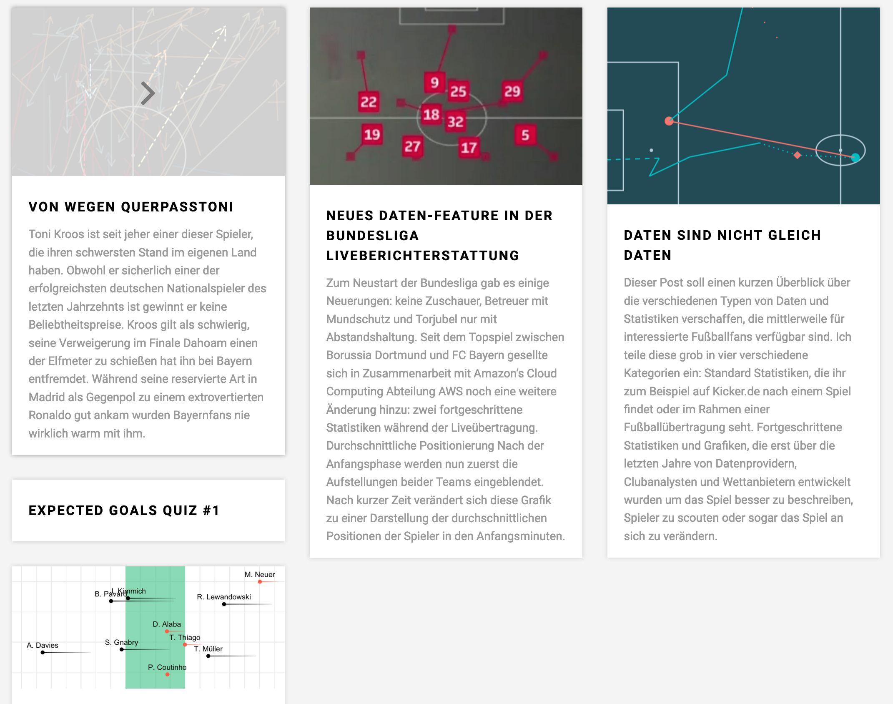

Hi, my name is Lars, I am a mathematician living in New York and I like to spend my past time with football (soccer) data analytics and visualizations. You can find my personal blog [here](https://larsmaurath.github.io/portfolio/).

### Other Projects

I have another project called [Keine Mathematik](https://www.keinemathematik.de/) which is a blog aiming to introduce data-driven football analytics to the German speaking football audience.

